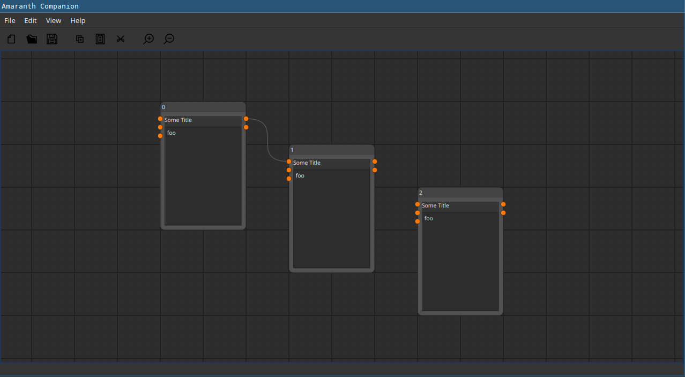

# Amaranth Companion
Visual Editor for Gateware based on [amaranth-lang](https://github.com/amaranth-lang/amaranth)

## Project Status
This project is currently still in the very early stages of development.
The current goal is to complete and refine the GUI.

- [x] GUI
  - [ ] editor
    - [x] elements
      - [x] node
      - [x] socket
      - [x] edge
    - [ ] functionality
      - [x] movement
      - [x] selection
      - [ ] add
      - [ ] delete
- [ ] backend
  - [ ] interface to amaranth

## Attribution
- [amaranth-lang](https://github.com/amaranth-lang/amaranth)
- [Node Editor in Python Tutorial Series](https://www.blenderfreak.com/tutorials/node-editor-tutorial-series/)

### References
- [Icestudio](https://icestudio.io/)
- [GNU Radio Companion](https://wiki.gnuradio.org/index.php/Guided_Tutorial_GRC)
